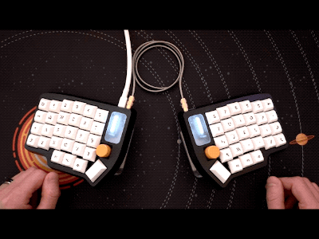

# sc_lulu_kmk

This repository exemplifies per-key animated LEDs on the Boardsource Lulu split keyboard. 

## Installation

Download the ```left/``` and ```right/``` folders from this repository, then copy them to the respective root folders on the left/right storage areas of the Lulu (these storage areas appear by default as ```LULUL```/```LULUR```, though these volume names will become ```SC_LULU_L```/```SC _LULU_R``` after this copy operation).

If all goes well, you should see behavior like this as you type:
